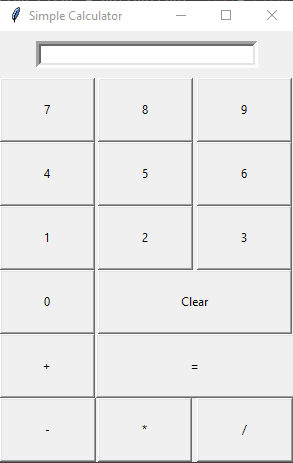

# Simple calculator
This is a simple calculator that is made using Tkinter and can do basic airthmetic operations like addition, subtraction, multiplication and division. 
It can perform operations between only two numbers at a time.

Functionalities
This calculator can perform following functions:
1. Addition
2. Subtraction
3. Multiplication
4. Division
